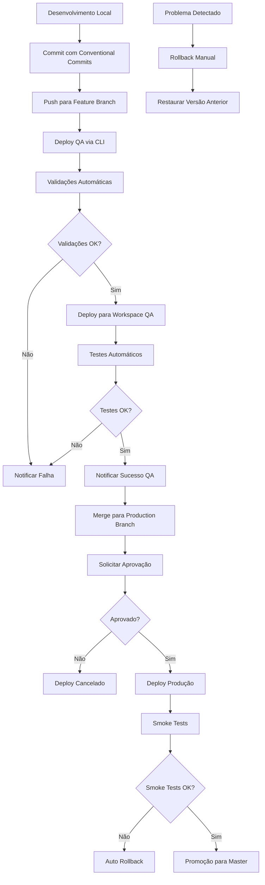
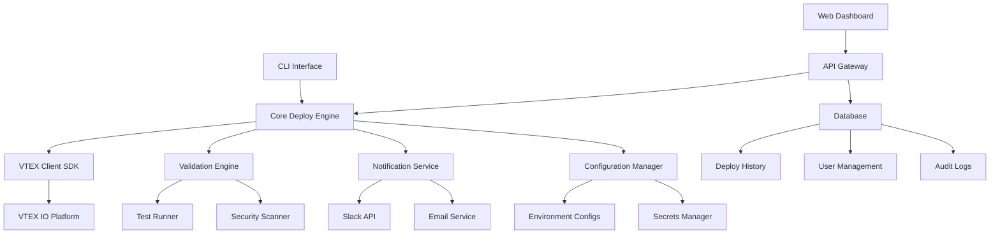

# Sistema de Deploy Automatizado para VTEX IO - Requisitos de Produto

## 1. Visão Geral do Produto

O Sistema de Deploy Automatizado para VTEX IO é uma solução completa que automatiza o processo de implantação de aplicações VTEX IO, garantindo segregação entre ambientes QA e Produção, validações automáticas, versionamento controlado e fluxo de trabalho padronizado.

O sistema resolve os problemas de deployments manuais propensos a erros, falta de padronização entre ambientes e ausência de validações automáticas, proporcionando maior confiabilidade e eficiência no processo de desenvolvimento e implantação de aplicações VTEX IO.

O produto visa reduzir o tempo de deploy em 70%, eliminar erros manuais em 95% e estabelecer um processo padronizado que pode ser adotado por equipes de desenvolvimento VTEX IO de qualquer tamanho.

## 2. Funcionalidades Principais

### 2.1 Papéis de Usuário

| Papel | Método de Acesso | Permissões Principais |
|-------|------------------|----------------------|
| Desenvolvedor | Acesso via CLI local e GitHub | Pode executar deploys QA, visualizar logs, executar rollbacks em QA |
| DevOps Engineer | Acesso completo via CLI e CI/CD | Pode executar todos os tipos de deploy, configurar ambientes, gerenciar secrets |
| Tech Lead | Acesso via CLI e aprovações | Pode aprovar deploys de produção, visualizar métricas, configurar políticas |
| QA Engineer | Acesso via interface web e CLI | Pode executar deploys QA, executar testes, visualizar resultados |

### 2.2 Módulos Funcionais

O sistema de deploy automatizado consiste nas seguintes páginas e interfaces principais:

1. **Interface CLI**: comandos para deploy, rollback, status e configuração
2. **Dashboard Web**: visualização de status, logs e métricas de deployment
3. **Sistema de Notificações**: integração com Slack e email para alertas
4. **Painel de Configuração**: gerenciamento de ambientes e credenciais
5. **Sistema de Aprovações**: workflow para aprovação de deploys de produção

### 2.3 Detalhes das Funcionalidades

| Módulo | Funcionalidade | Descrição da Funcionalidade |
|--------|----------------|------------------------------|
| **Interface CLI** | Comandos de Deploy | Executar deploy para QA (`deploy:qa`) e Produção (`deploy:prod`) com validações automáticas, geração de versão semântica, instalação de app |
| **Interface CLI** | Sistema de Rollback | Reverter para versão anterior (`rollback`) com validação de versão, backup automático, verificação de integridade |
| **Interface CLI** | Status e Monitoramento | Visualizar status atual (`status`) incluindo versão ativa, workspace, health checks, logs recentes |
| **Dashboard Web** | Visualização de Deployments | Exibir histórico de deployments, status atual, métricas de performance, gráficos de sucesso/falha |
| **Dashboard Web** | Logs e Debugging | Mostrar logs detalhados de deployment, filtros por ambiente/data, download de logs, análise de erros |
| **Sistema de Notificações** | Alertas Slack/Email | Enviar notificações de sucesso/falha, alertas de segurança, resumos de deployment, escalação de problemas |
| **Painel de Configuração** | Gerenciamento de Ambientes | Configurar contas VTEX, workspaces, credenciais, políticas de deployment, aprovações |
| **Sistema de Aprovações** | Workflow de Produção | Solicitar aprovação para produção, notificar aprovadores, registrar decisões, auditoria completa |
| **Validação Automática** | Testes e Qualidade | Executar testes unitários/integração, validação de manifest, scan de segurança, verificação de dependências |
| **Versionamento** | Semantic Versioning | Gerar versões automáticas baseadas em conventional commits, tags QA/Produção, controle de breaking changes |

## 3. Fluxo Principal de Processos

### 3.1 Fluxo de Desenvolvimento (QA)

O desenvolvedor trabalha em uma feature branch, faz commit seguindo conventional commits, e executa o deploy para QA. O sistema automaticamente valida o código, executa testes, gera versão QA, faz deploy no workspace QA e notifica o resultado.

### 3.2 Fluxo de Produção

Após validação em QA, o código é mergeado para a branch production. O sistema executa validações completas de produção, requer aprovação manual, faz deploy no workspace prodtest, executa smoke tests, e após sucesso, disponibiliza para promoção ao master.

### 3.3 Fluxo de Rollback

Em caso de problemas, o sistema permite rollback rápido para versão anterior, com validação automática da versão de destino, backup da versão atual, e verificação de integridade pós-rollback.

## 4. Design da Interface do Usuário

### 4.1 Estilo de Design

- **Cores Primárias**: Azul VTEX (#142032), Verde Sucesso (#00C853), Vermelho Erro (#F44336)
- **Cores Secundárias**: Cinza Claro (#F5F5F5), Cinza Escuro (#424242), Amarelo Alerta (#FFC107)
- **Estilo de Botões**: Botões arredondados com sombra sutil, estados hover e disabled bem definidos
- **Fontes**: Inter para interface web (16px base), Fira Code para CLI e logs (14px)
- **Layout**: Design limpo e minimalista, baseado em cards, navegação lateral para dashboard
- **Ícones**: Material Design Icons para consistência, ícones específicos para status de deploy

### 4.2 Visão Geral do Design das Páginas

| Módulo | Funcionalidade | Elementos de UI |
|--------|----------------|-----------------|
| **CLI Interface** | Comandos de Deploy | Terminal colorido com progress bars, spinners para loading, tabelas para status, cores para diferentes tipos de log (info/warn/error) |
| **Dashboard Web** | Painel Principal | Header com navegação, sidebar com filtros, cards de métricas principais, gráficos de linha para tendências, tabela de deployments recentes |
| **Dashboard Web** | Detalhes de Deploy | Breadcrumb navigation, timeline de etapas do deploy, logs com syntax highlighting, botões de ação (rollback, retry) |
| **Configuração** | Gerenciamento | Formulários organizados em tabs, validação em tempo real, toggle switches para features, campos de senha mascarados |
| **Aprovações** | Workflow | Cards de solicitação pendente, botões de aprovar/rejeitar, histórico de aprovações, comentários e justificativas |
| **Notificações** | Centro de Alertas | Lista de notificações com badges, filtros por tipo/data, preview de conteúdo, links para ações relacionadas |

### 4.3 Responsividade

O sistema é desktop-first com adaptação para tablets. A interface CLI é otimizada para terminais desktop, enquanto o dashboard web é responsivo para tablets (768px+). Não há otimização específica para mobile, pois o público-alvo são desenvolvedores que trabalham primariamente em desktops.

## 5. Requisitos Técnicos

### 5.1 Arquitetura do Sistema

### 5.2 Stack Tecnológico

- **Frontend CLI**: Node.js 18+, TypeScript, Commander.js para CLI
- **Backend**: Node.js 18+, Express.js, TypeScript
- **Database**: PostgreSQL para histórico e configurações, Redis para cache
- **Containerização**: Docker, Docker Compose para desenvolvimento
- **CI/CD**: GitHub Actions, suporte para GitLab CI
- **Monitoramento**: Winston para logs, Prometheus para métricas
- **Segurança**: JWT para autenticação, bcrypt para senhas, Vault para secrets

### 5.3 Integrações Externas

- **VTEX IO Platform**: Via VTEX CLI e APIs REST
- **GitHub/GitLab**: Para webhooks e status checks
- **Slack**: Para notificações via webhooks
- **Email**: SMTP para notificações por email
- **Secrets Management**: AWS Secrets Manager ou HashiCorp Vault

## 6. Requisitos de Performance

### 6.1 Métricas de Performance

| Métrica | Valor Esperado | Medição |
|---------|----------------|---------|
| Tempo de Deploy QA | < 10 minutos | Tempo total do comando até sucesso |
| Tempo de Deploy Produção | < 20 minutos | Incluindo todas as validações |
| Tempo de Rollback | < 5 minutos | Tempo para restaurar versão anterior |
| Disponibilidade do Sistema | > 99.5% | Uptime mensal |
| Taxa de Sucesso Deploy | > 95% | Deploys bem-sucedidos vs total |

### 6.2 Requisitos de Escalabilidade

- Suportar até 50 deployments simultâneos
- Processar até 1000 deployments por dia
- Armazenar histórico de 12 meses de deployments
- Suportar até 100 usuários simultâneos no dashboard

## 7. Requisitos de Segurança

### 7.1 Autenticação e Autorização

- Autenticação via tokens VTEX e GitHub/GitLab
- Controle de acesso baseado em papéis (RBAC)
- Rotação automática de tokens a cada 24 horas
- Auditoria completa de todas as ações

### 7.2 Proteção de Dados

- Criptografia de secrets em repouso
- Comunicação via HTTPS/TLS 1.3
- Logs sem informações sensíveis
- Backup automático de configurações

## 8. Critérios de Aceitação

### 8.1 Funcionalidades Obrigatórias

✅ **Deploy QA Automatizado**: Sistema deve executar deploy completo para QA em menos de 10 minutos
✅ **Deploy Produção com Aprovação**: Sistema deve requerer e processar aprovação manual para produção
✅ **Rollback Rápido**: Sistema deve permitir rollback em menos de 5 minutos
✅ **Validações Automáticas**: Sistema deve executar testes, validações de manifest e scan de segurança
✅ **Notificações**: Sistema deve enviar notificações via Slack e email para todos os eventos
✅ **Versionamento Semântico**: Sistema deve gerar versões automaticamente baseado em conventional commits
✅ **Logs Detalhados**: Sistema deve manter logs completos de todas as operações
✅ **Interface CLI Intuitiva**: Comandos simples e documentação clara

### 8.2 Critérios de Qualidade

✅ **Cobertura de Testes**: Mínimo 80% de cobertura de código
✅ **Documentação**: README completo, guias de instalação e uso
✅ **Performance**: Todos os SLAs de performance atendidos
✅ **Segurança**: Zero vulnerabilidades críticas ou altas
✅ **Usabilidade**: Setup inicial em menos de 30 minutos
✅ **Confiabilidade**: Taxa de sucesso > 95% em ambiente de produção

## 9. Roadmap de Implementação

### 9.1 Fase 1 - Fundação (Semanas 1-2)
- Setup do projeto e estrutura base
- Implementação do VTEX Client
- Sistema básico de configuração
- Testes unitários iniciais

### 9.2 Fase 2 - Deploy QA (Semanas 3-4)
- Engine de deploy para QA
- Validações automáticas
- Sistema de notificações
- CLI básico

### 9.3 Fase 3 - Deploy Produção (Semanas 5-6)
- Engine de deploy para produção
- Sistema de aprovações
- Validações avançadas de segurança
- Auto-rollback

### 9.4 Fase 4 - Dashboard e Monitoramento (Semanas 7-8)
- Interface web para dashboard
- Métricas e monitoramento
- Logs centralizados
- Sistema de alertas

### 9.5 Fase 5 - Finalização (Semana 9)
- Testes de integração completos
- Documentação final
- Treinamento da equipe
- Deploy em produção

## 10. Riscos e Mitigações

### 10.1 Riscos Técnicos

| Risco | Probabilidade | Impacto | Mitigação |
|-------|---------------|---------|-----------|
| Instabilidade da API VTEX | Média | Alto | Implementar retry logic e circuit breaker |
| Conflitos de workspace | Alta | Médio | Validação prévia e cleanup automático |
| Falha na autenticação | Baixa | Alto | Múltiplos métodos de auth e fallback |
| Performance inadequada | Média | Médio | Testes de carga e otimizações |

### 10.2 Riscos de Negócio

| Risco | Probabilidade | Impacto | Mitigação |
|-------|---------------|---------|-----------|
| Resistência da equipe | Média | Alto | Treinamento e documentação clara |
| Mudanças na plataforma VTEX | Baixa | Alto | Monitoramento de updates e versionamento |
| Complexidade de setup | Alta | Médio | Automação máxima e guias detalhados |

## 11. Métricas de Sucesso

### 11.1 KPIs Principais

- **Redução do Tempo de Deploy**: Meta de 70% de redução
- **Taxa de Erro de Deploy**: Meta < 5%
- **Tempo de Rollback**: Meta < 5 minutos
- **Adoção da Ferramenta**: Meta 100% da equipe em 30 dias
- **Satisfação do Usuário**: Meta > 4.5/5 em pesquisa

### 11.2 Métricas Operacionais

- Número de deployments por dia
- Tempo médio de resolução de problemas
- Cobertura de testes automatizados
- Número de rollbacks necessários
- Tempo de inatividade causado por deployments

## 12. Aprovações

| Stakeholder | Papel | Status | Data |
|-------------|-------|--------|------|
| Tech Lead | Aprovação Técnica | ⏳ Pendente | - |
| Product Owner | Aprovação de Produto | ⏳ Pendente | - |
| DevOps Manager | Aprovação de Infraestrutura | ⏳ Pendente | - |
| Security Team | Aprovação de Segurança | ⏳ Pendente | - |

---

Este documento de requisitos de produto serve como base para o desenvolvimento do Sistema de Deploy Automatizado para VTEX IO, garantindo que todas as funcionalidades, requisitos técnicos e critérios de aceitação estejam claramente definidos e alinhados com as necessidades da equipe de desenvolvimento.