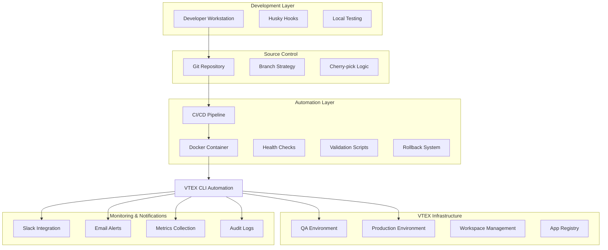
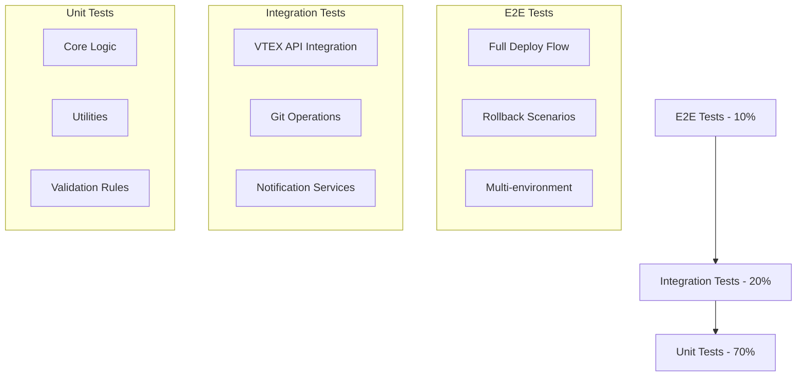

# Arquitetura Técnica - Sistema de Deploy Automatizado VTEX IO

## 1. Arquitetura do Sistema



## 2. Tecnologias e Stack Técnico

### 2.1 Core Technologies
- **Runtime**: Node.js 18+ LTS
- **Package Manager**: npm/yarn
- **Containerization**: Docker + Docker Compose
- **CI/CD**: GitHub Actions / GitLab CI
- **Version Control**: Git com Git Flow

### 2.2 VTEX Specific
- **VTEX CLI**: v3.x (latest)
- **VTEX Toolbelt**: Para operações avançadas
- **VTEX IO**: Runtime para apps
- **Workspace API**: Gerenciamento de ambientes

### 2.3 Development Tools
- **Code Quality**: ESLint, Prettier, Husky
- **Testing**: Jest, Supertest, Cypress
- **Documentation**: JSDoc, Markdown
- **Monitoring**: Winston (logging), Prometheus (metrics)

### 2.4 External Integrations
- **Notifications**: Slack API, Nodemailer
- **Security**: Vault/AWS Secrets Manager
- **Monitoring**: DataDog, New Relic (opcional)

## 3. Componentes do Sistema

### 3.1 Core Modules

#### 3.1.1 Deploy Manager
```typescript
interface DeployManager {
  deployToQA(branch: string): Promise<DeployResult>
  deployToProduction(version: string): Promise<DeployResult>
  rollback(version: string): Promise<RollbackResult>
  getDeployStatus(deployId: string): Promise<DeployStatus>
}
```

#### 3.1.2 VTEX Client
```typescript
interface VTEXClient {
  authenticate(token: string): Promise<boolean>
  createWorkspace(name: string): Promise<Workspace>
  installApp(app: string, version: string): Promise<InstallResult>
  promoteWorkspace(workspace: string): Promise<PromoteResult>
  listApps(workspace?: string): Promise<App[]>
}
```

#### 3.1.3 Git Operations
```typescript
interface GitOperations {
  cherryPick(commits: string[]): Promise<CherryPickResult>
  createBranch(name: string, base: string): Promise<Branch>
  mergeBranch(source: string, target: string): Promise<MergeResult>
  validateBranch(name: string): Promise<ValidationResult>
}
```

#### 3.1.4 Validation Engine
```typescript
interface ValidationEngine {
  validateManifest(manifest: object): Promise<ValidationResult>
  runTests(testSuite: string): Promise<TestResult>
  checkDependencies(): Promise<DependencyCheck>
  securityScan(): Promise<SecurityResult>
}
```

### 3.2 Utility Modules

#### 3.2.1 Configuration Manager
```typescript
interface ConfigManager {
  loadConfig(environment: 'qa' | 'prod'): Promise<Config>
  validateConfig(config: Config): Promise<boolean>
  getSecret(key: string): Promise<string>
}
```

#### 3.2.2 Logger
```typescript
interface Logger {
  info(message: string, meta?: object): void
  error(message: string, error?: Error): void
  audit(action: string, user: string, details: object): void
}
```

#### 3.2.3 Notification Service
```typescript
interface NotificationService {
  sendSlack(message: SlackMessage): Promise<void>
  sendEmail(email: EmailMessage): Promise<void>
  notifyDeploySuccess(deploy: DeployResult): Promise<void>
  notifyDeployFailure(deploy: DeployResult, error: Error): Promise<void>
}
```

## 4. Estrutura de Diretórios

```
vtex-deploy-automation/
├── .github/
│   └── workflows/
│       ├── deploy-qa.yml
│       ├── deploy-prod.yml
│       └── test.yml
├── .husky/
│   ├── pre-commit
│   ├── pre-push
│   └── commit-msg
├── docker/
│   ├── Dockerfile
│   ├── docker-compose.yml
│   ├── docker-compose.qa.yml
│   └── docker-compose.prod.yml
├── src/
│   ├── core/
│   │   ├── deploy-manager.ts
│   │   ├── vtex-client.ts
│   │   ├── git-operations.ts
│   │   └── validation-engine.ts
│   ├── utils/
│   │   ├── config-manager.ts
│   │   ├── logger.ts
│   │   ├── notification-service.ts
│   │   └── health-checker.ts
│   ├── types/
│   │   ├── deploy.types.ts
│   │   ├── vtex.types.ts
│   │   └── config.types.ts
│   └── cli/
│       ├── commands/
│       │   ├── deploy-qa.ts
│       │   ├── deploy-prod.ts
│       │   ├── rollback.ts
│       │   └── status.ts
│       └── index.ts
├── scripts/
│   ├── deploy-qa.sh
│   ├── deploy-prod.sh
│   ├── promote-to-master.sh
│   ├── rollback.sh
│   ├── cherry-pick-feature.sh
│   └── health-check.sh
├── tests/
│   ├── unit/
│   │   ├── core/
│   │   └── utils/
│   ├── integration/
│   │   ├── vtex-api.test.ts
│   │   └── deploy-flow.test.ts
│   └── e2e/
│       ├── full-deploy.test.ts
│       └── rollback.test.ts
├── config/
│   ├── environments/
│   │   ├── qa.json
│   │   ├── prod.json
│   │   └── local.json
│   ├── eslint.config.js
│   ├── jest.config.js
│   └── docker.config.js
├── docs/
│   ├── api/
│   ├── deployment/
│   ├── troubleshooting/
│   └── examples/
├── .env.example
├── .env.qa.example
├── .env.prod.example
├── .gitignore
├── .dockerignore
├── package.json
├── tsconfig.json
├── README.md
└── CHANGELOG.md
```

## 5. Configuração de Ambiente

### 5.1 Variáveis de Ambiente

#### 5.1.1 QA Environment (.env.qa)
```bash
# VTEX Configuration
VTEX_ACCOUNT=myvendorqa
VTEX_WORKSPACE=master
VTEX_AUTH_TOKEN=<encrypted_token>
VTEX_USER_EMAIL=dev@vendor.com

# App Configuration
APP_VENDOR=myvendor
APP_NAME=myapp
APP_VERSION_PREFIX=qa

# Deployment Settings
AUTO_INSTALL=true
AUTO_PUBLISH=false
SKIP_TESTS=false
DEPLOYMENT_TIMEOUT=300000

# Workspace Management
CREATE_WORKSPACE=true
WORKSPACE_PREFIX=dev-
WORKSPACE_CLEANUP=true
WORKSPACE_TTL=7d

# Notifications
SLACK_WEBHOOK_URL=<webhook_url>
SLACK_CHANNEL=#deployments
EMAIL_SMTP_HOST=smtp.gmail.com
EMAIL_SMTP_PORT=587
EMAIL_FROM=noreply@vendor.com
EMAIL_TO=team@vendor.com

# Security
ENABLE_SECURITY_SCAN=true
BLOCK_ON_VULNERABILITIES=true
TOKEN_REFRESH_INTERVAL=3600

# Logging
LOG_LEVEL=info
LOG_FORMAT=json
AUDIT_ENABLED=true

# Git Configuration
GIT_MAIN_BRANCH=main
GIT_PRODUCTION_BRANCH=production
ALLOWED_BRANCH_PREFIXES=feat,fix,chore,refactor

# Docker
DOCKER_REGISTRY=<registry_url>
DOCKER_TAG_PREFIX=qa
```

#### 5.1.2 Production Environment (.env.prod)
```bash
# VTEX Configuration
VTEX_ACCOUNT=myvendor
VTEX_WORKSPACE=prodtest
VTEX_AUTH_TOKEN=<encrypted_token>
VTEX_USER_EMAIL=deploy@vendor.com

# App Configuration
APP_VENDOR=myvendor
APP_NAME=myapp
APP_VERSION_PREFIX=

# Deployment Settings
AUTO_INSTALL=true
AUTO_PUBLISH=false
SKIP_TESTS=false
REQUIRE_APPROVAL=true
DEPLOYMENT_TIMEOUT=600000

# Workspace Management
CREATE_WORKSPACE=false
WORKSPACE_NAME=prodtest
PROMOTE_REQUIRES_APPROVAL=true
AUTO_PROMOTE_TO_MASTER=false

# Rollback Configuration
ENABLE_AUTO_ROLLBACK=true
ROLLBACK_ON_ERROR=true
KEEP_PREVIOUS_VERSIONS=5
ROLLBACK_TIMEOUT=180000

# Notifications
SLACK_WEBHOOK_URL=<webhook_url>
SLACK_CHANNEL=#production-alerts
EMAIL_SMTP_HOST=smtp.gmail.com
EMAIL_SMTP_PORT=587
EMAIL_FROM=alerts@vendor.com
EMAIL_TO=team@vendor.com,manager@vendor.com
EMAIL_NOTIFICATION=true

# Security
ENABLE_SECURITY_SCAN=true
BLOCK_ON_VULNERABILITIES=true
TOKEN_REFRESH_INTERVAL=1800
SECURITY_SCAN_TIMEOUT=300000

# Monitoring
METRICS_ENABLED=true
METRICS_ENDPOINT=/metrics
HEALTH_CHECK_INTERVAL=30000
PERFORMANCE_MONITORING=true

# Logging
LOG_LEVEL=warn
LOG_FORMAT=json
AUDIT_ENABLED=true
LOG_RETENTION_DAYS=90

# Git Configuration
GIT_MAIN_BRANCH=production
ALLOWED_BRANCH_PREFIXES=release,hotfix

# Docker
DOCKER_REGISTRY=<registry_url>
DOCKER_TAG_PREFIX=prod
DOCKER_SECURITY_SCAN=true
```

### 5.2 Secrets Management

#### 5.2.1 GitHub Secrets
```yaml
# Required secrets for GitHub Actions
VTEX_AUTH_TOKEN_QA: <qa_token>
VTEX_AUTH_TOKEN_PROD: <prod_token>
SLACK_WEBHOOK_URL: <webhook_url>
EMAIL_PASSWORD: <smtp_password>
DOCKER_REGISTRY_TOKEN: <registry_token>
```

#### 5.2.2 Vault Configuration (Opcional)
```json
{
  "vault": {
    "address": "https://vault.company.com",
    "auth_method": "aws",
    "secrets_path": "secret/vtex-deploy",
    "token_ttl": 3600
  }
}
```

## 6. Estratégia de Testes

### 6.1 Pirâmide de Testes



### 6.2 Test Configuration

#### 6.2.1 Jest Configuration (jest.config.js)
```javascript
module.exports = {
  preset: 'ts-jest',
  testEnvironment: 'node',
  roots: ['<rootDir>/src', '<rootDir>/tests'],
  testMatch: [
    '**/__tests__/**/*.ts',
    '**/?(*.)+(spec|test).ts'
  ],
  collectCoverageFrom: [
    'src/**/*.ts',
    '!src/**/*.d.ts',
    '!src/types/**/*'
  ],
  coverageThreshold: {
    global: {
      branches: 80,
      functions: 80,
      lines: 80,
      statements: 80
    }
  },
  setupFilesAfterEnv: ['<rootDir>/tests/setup.ts'],
  testTimeout: 30000
}
```

### 6.3 Tipos de Testes

#### 6.3.1 Unit Tests
```typescript
// tests/unit/core/deploy-manager.test.ts
describe('DeployManager', () => {
  let deployManager: DeployManager
  let mockVtexClient: jest.Mocked<VTEXClient>
  
  beforeEach(() => {
    mockVtexClient = createMockVtexClient()
    deployManager = new DeployManager(mockVtexClient)
  })
  
  describe('deployToQA', () => {
    it('should deploy successfully to QA environment', async () => {
      // Test implementation
    })
    
    it('should handle deployment failures gracefully', async () => {
      // Test implementation
    })
  })
})
```

#### 6.3.2 Integration Tests
```typescript
// tests/integration/vtex-api.test.ts
describe('VTEX API Integration', () => {
  let vtexClient: VTEXClient
  
  beforeAll(async () => {
    vtexClient = new VTEXClient(testConfig)
    await vtexClient.authenticate(process.env.VTEX_TEST_TOKEN!)
  })
  
  it('should create and manage workspaces', async () => {
    // Integration test implementation
  })
})
```

#### 6.3.3 E2E Tests
```typescript
// tests/e2e/full-deploy.test.ts
describe('Full Deploy Flow', () => {
  it('should complete full QA to Production deploy', async () => {
    // E2E test implementation
  })
})
```

## 7. Critérios de Aceitação Técnicos

### 7.1 Performance
- [ ] Deploy QA: < 5 minutos
- [ ] Deploy Produção: < 10 minutos
- [ ] Rollback: < 3 minutos
- [ ] Health Check: < 30 segundos

### 7.2 Reliability
- [ ] Taxa de sucesso > 95%
- [ ] Zero downtime durante deploys
- [ ] Rollback automático em caso de falha
- [ ] Recuperação automática de falhas temporárias

### 7.3 Security
- [ ] Tokens criptografados em repouso
- [ ] Rotação automática de credenciais
- [ ] Audit trail completo
- [ ] Validação de vulnerabilidades

### 7.4 Usability
- [ ] Comandos CLI intuitivos
- [ ] Documentação completa
- [ ] Mensagens de erro claras
- [ ] Logs estruturados

### 7.5 Maintainability
- [ ] Cobertura de testes > 80%
- [ ] Código TypeScript tipado
- [ ] Documentação API atualizada
- [ ] Configuração via ambiente

## 8. Monitoramento e Observabilidade

### 8.1 Métricas Chave
```typescript
interface DeployMetrics {
  deployCount: number
  successRate: number
  averageDeployTime: number
  rollbackCount: number
  errorRate: number
}
```

### 8.2 Health Checks
```typescript
interface HealthCheck {
  vtexApiStatus: 'healthy' | 'degraded' | 'down'
  gitConnectivity: boolean
  dockerStatus: 'running' | 'stopped'
  lastDeployTime: Date
  systemLoad: number
}
```

### 8.3 Alerting Rules
- Deploy failure → Slack + Email
- High error rate (>10%) → Slack
- System down → PagerDuty (se configurado)
- Long deploy time (>15min) → Slack

## 9. Segurança

### 9.1 Autenticação e Autorização
- VTEX App Tokens com escopo mínimo
- Rotação automática de tokens (90 dias)
- Princípio do menor privilégio
- Auditoria de acesso

### 9.2 Secrets Management
- Nunca armazenar secrets em código
- Usar GitHub Secrets ou Vault
- Criptografia em trânsito e repouso
- Logs sem informações sensíveis

### 9.3 Network Security
- HTTPS para todas as comunicações
- Validação de certificados SSL
- Rate limiting para APIs
- IP whitelisting (se necessário)

## 10. Disaster Recovery

### 10.1 Backup Strategy
- Backup automático de configurações
- Versionamento de releases
- Snapshot de workspaces críticos
- Documentação de procedimentos

### 10.2 Recovery Procedures
- Rollback automático em falhas
- Procedimentos manuais documentados
- Testes regulares de recovery
- RTO: 15 minutos, RPO: 1 hora

## 11. Roadmap de Implementação

### Fase 1: Core Infrastructure (Semanas 1-2)
- [ ] Setup básico do projeto
- [ ] Configuração Docker
- [ ] VTEX Client básico
- [ ] Testes unitários fundamentais

### Fase 2: QA Automation (Semanas 3-4)
- [ ] Deploy Manager para QA
- [ ] Git Operations
- [ ] Validation Engine
- [ ] CI/CD para QA

### Fase 3: Production Automation (Semanas 5-6)
- [ ] Deploy Manager para Produção
- [ ] Cherry-pick automation
- [ ] Rollback system
- [ ] Security enhancements

### Fase 4: Advanced Features (Semanas 7-8)
- [ ] Monitoring e métricas
- [ ] Notification system
- [ ] Health checks
- [ ] Performance optimization

### Fase 5: Documentation & Training (Semana 9)
- [ ] Documentação completa
- [ ] Treinamento da equipe
- [ ] Runbooks operacionais
- [ ] Go-live preparation