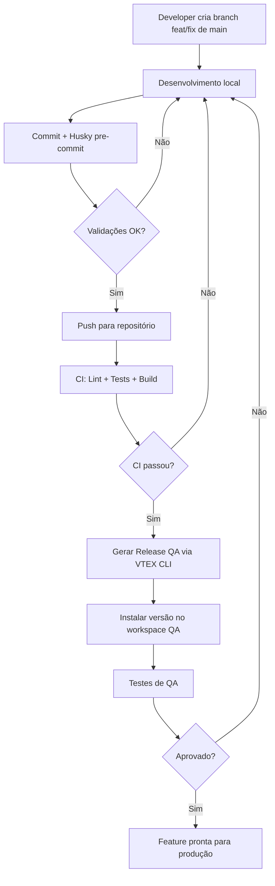
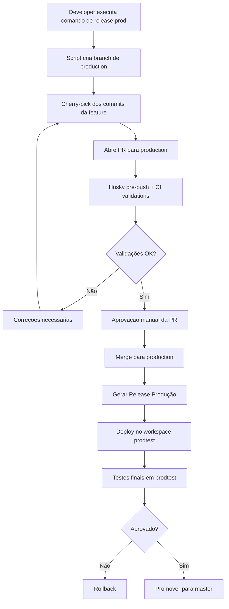

# PRD - Sistema de Deploy Automatizado para VTEX IO

## 1. Visão Geral

### 1.1 Objetivo
Criar um sistema de deploy automatizado para aplicações VTEX IO que garanta segregação entre ambientes de QA e Produção, com validações automáticas, versionamento controlado e fluxo de trabalho padronizado.

### 1.2 Problema
Atualmente, o processo de deploy manual em ambientes VTEX IO é suscetível a erros humanos, falta de padronização e dificuldade de rastreabilidade. A necessidade de gerenciar múltiplos ambientes (QA e Produção) e garantir que apenas features aprovadas cheguem à produção requer automação robusta.

### 1.3 Escopo
- Automação completa do fluxo de deploy de QA até Produção
- Validação de código pré-commit e pré-push com Husky
- Geração automática de releases VTEX IO
- Instalação automatizada em workspaces específicos
- Segregação clara entre ambientes QA e Produção
- Containerização via Docker para execução local

---

## 2. Ambientes e Contas

### 2.1 Conta QA (Desenvolvimento)
- **Account Name**: `{vendor}qa` ou `{vendor}dev`
- **Finalidade**: Testes, validações e homologação de features
- **Workspace Principal**: `master`
- **Workspaces de Desenvolvimento**: Dinâmicos por developer

### 2.2 Conta Produção
- **Account Name**: `{vendor}`
- **Finalidade**: Ambiente de produção (live)
- **Workspace de Testes**: `prodtest`
- **Workspace Principal**: `master`

---

## 3. Estratégia de Branching

### 3.1 Estrutura de Branches

```
main (QA - sempre sincronizada com QA master)
│
├── feat/nome-da-feature
├── fix/nome-do-bug
├── chore/nome-da-tarefa
├── refactor/nome-da-refatoracao
│
production (Produção - sempre sincronizada com Produção master)
│
├── release/v{major}.{minor}.{patch}-qa
└── release/v{major}.{minor}.{patch}-prod
```

### 3.2 Padrão de Nomenclatura

| Tipo | Formato | Exemplo |
|------|---------|---------|
| Feature | `feat/nome-descritivo` | `feat/add-custom-checkout` |
| Bugfix | `fix/nome-descritivo` | `fix/cart-calculation-error` |
| Hotfix | `hotfix/nome-descritivo` | `hotfix/critical-payment-issue` |
| Chore | `chore/nome-descritivo` | `chore/update-dependencies` |
| Refactor | `refactor/nome-descritivo` | `refactor/optimize-graphql-queries` |

### 3.3 Regras de Branching
- **main**: Base para desenvolvimento em QA
- **production**: Base para releases de produção
- Branches de desenvolvimento sempre partem de `main`
- Branches de release para produção partem de `production`
- Nunca fazer merge direto de `main` para `production`

---

## 4. Fluxo de Trabalho

### 4.1 Fluxo de Desenvolvimento (QA)



### 4.2 Fluxo de Produção



### 4.3 Comandos CLI Propostos

```bash
# Iniciar desenvolvimento
npm run dev:start <tipo> <nome>
# Exemplo: npm run dev:start feat add-custom-filter

# Finalizar desenvolvimento e preparar para QA
npm run qa:deploy

# Preparar release para produção
npm run prod:prepare <branch-name>
# Exemplo: npm run prod:prepare feat/add-custom-filter

# Deploy para produção
npm run prod:deploy

# Rollback de produção
npm run prod:rollback <version>
```

---

## 5. Validações e Qualidade

### 5.1 Husky Hooks

#### 5.1.1 Pre-commit
```json
{
  "pre-commit": [
    "lint-staged",
    "vtex-validate-manifest"
  ]
}
```

**Validações:**
- ESLint com regras VTEX
- Prettier para formatação
- Validação do `manifest.json`
- Validação de dependências
- Testes unitários relacionados

#### 5.1.2 Pre-push
```json
{
  "pre-push": [
    "npm run test",
    "npm run build",
    "vtex-validate-app"
  ]
}
```

**Validações:**
- Todos os testes passando
- Build sem erros
- Validação de builder dependencies
- Análise de bundle size

### 5.2 CI/CD Pipeline (GitHub Actions / GitLab CI)

```yaml
stages:
  - validate
  - build
  - deploy-qa
  - deploy-prod
```

**Etapas:**
1. **Validate**: Lint, testes, type-checking
2. **Build**: Compilação da aplicação
3. **Deploy QA**: Release e instalação automática em QA
4. **Deploy Prod**: Release e instalação em prodtest (manual trigger)

---

## 6. Versionamento Semântico

### 6.1 Estratégia de Versões

- **MAJOR**: Mudanças breaking changes
- **MINOR**: Novas funcionalidades backward-compatible
- **PATCH**: Correções de bugs

### 6.2 Formato de Versões

- **QA**: `{major}.{minor}.{patch}-qa+{build}`
  - Exemplo: `1.5.2-qa+20250103`
- **Produção**: `{major}.{minor}.{patch}`
  - Exemplo: `1.5.2`

### 6.3 Automação de Versão

- Versão automática baseada em commits convencionais
- Tags Git sincronizadas com versões VTEX
- Changelog gerado automaticamente

---

## 7. Arquitetura Docker

### 7.1 Estrutura de Containers

```
vtex-deploy-automation/
├── docker-compose.yml
├── Dockerfile
├── .dockerignore
└── scripts/
    ├── deploy-qa.sh
    ├── deploy-prod.sh
    ├── login.sh
    └── release.sh
```

### 7.2 Docker Compose

```yaml
version: '3.8'

services:
  vtex-cli:
    build: .
    container_name: vtex-deploy-automation
    volumes:
      - ./:/app
      - vtex-cache:/root/.vtex
    env_file:
      - .env.qa    # ou .env.prod
    working_dir: /app
    command: tail -f /dev/null

volumes:
  vtex-cache:
```

### 7.3 Dockerfile

```dockerfile
FROM node:18-alpine

# Instalar VTEX CLI e dependências
RUN npm install -g vtex

# Instalar ferramentas auxiliares
RUN apk add --no-cache git bash jq curl

# Criar diretório de trabalho
WORKDIR /app

# Copiar scripts
COPY scripts/ /scripts/
RUN chmod +x /scripts/*.sh

CMD ["bash"]
```

---

## 8. Configuração de Ambiente

### 8.1 .env.qa (Exemplo)

```bash
# VTEX Account Configuration
VTEX_ACCOUNT=myvendorqa
VTEX_WORKSPACE=master
VTEX_ENV=qa

# Authentication
VTEX_AUTH_TOKEN=eyJhbGciOiJIUzI1NiIsInR5cCI6IkpXVCJ9...
VTEX_USER_EMAIL=dev@vendor.com

# App Configuration
APP_VENDOR=myvendor
APP_NAME=myapp
APP_VERSION_PREFIX=qa

# Deployment Configuration
AUTO_INSTALL=true
AUTO_PUBLISH=false
SKIP_TESTS=false

# Workspace Configuration
CREATE_WORKSPACE=true
WORKSPACE_PREFIX=dev-

# Notification Configuration (opcional)
SLACK_WEBHOOK_URL=https://hooks.slack.com/services/YOUR/WEBHOOK/URL
NOTIFY_ON_SUCCESS=true
NOTIFY_ON_FAILURE=true

# Git Configuration
GIT_BRANCH_PREFIX=feat,fix,chore,refactor
GIT_MAIN_BRANCH=main

# Docker Configuration
DOCKER_BUILD_ARGS=--no-cache
```

### 8.2 .env.prod (Exemplo)

```bash
# VTEX Account Configuration
VTEX_ACCOUNT=myvendor
VTEX_WORKSPACE=prodtest
VTEX_ENV=production

# Authentication
VTEX_AUTH_TOKEN=eyJhbGciOiJIUzI1NiIsInR5cCI6IkpXVCJ9...
VTEX_USER_EMAIL=deploy@vendor.com

# App Configuration
APP_VENDOR=myvendor
APP_NAME=myapp
APP_VERSION_PREFIX=

# Deployment Configuration
AUTO_INSTALL=true
AUTO_PUBLISH=false
SKIP_TESTS=false
REQUIRE_APPROVAL=true

# Workspace Configuration
CREATE_WORKSPACE=false
WORKSPACE_NAME=prodtest

# Promotion Configuration
AUTO_PROMOTE_TO_MASTER=false
PROMOTE_REQUIRES_APPROVAL=true

# Notification Configuration
SLACK_WEBHOOK_URL=https://hooks.slack.com/services/YOUR/WEBHOOK/URL
NOTIFY_ON_SUCCESS=true
NOTIFY_ON_FAILURE=true
EMAIL_NOTIFICATION=true
EMAIL_RECIPIENTS=team@vendor.com,manager@vendor.com

# Git Configuration
GIT_BRANCH_PREFIX=release
GIT_MAIN_BRANCH=production

# Rollback Configuration
ENABLE_AUTO_ROLLBACK=true
ROLLBACK_ON_ERROR=true
KEEP_PREVIOUS_VERSIONS=3

# Security Configuration
ENABLE_SECURITY_SCAN=true
BLOCK_ON_VULNERABILITIES=true

# Docker Configuration
DOCKER_BUILD_ARGS=--no-cache
```

### 8.3 Segurança de Credenciais

**⚠️ IMPORTANTE:**
- Nunca commitar arquivos `.env` no repositório
- Usar `.env.example` como template
- Armazenar tokens em secret managers (GitHub Secrets, AWS Secrets Manager, etc.)
- Rotacionar tokens periodicamente
- Usar tokens com permissões mínimas necessárias

---

## 9. Scripts de Automação

### 9.1 deploy-qa.sh

```bash
#!/bin/bash
set -e

source .env.qa

echo "🚀 Iniciando deploy para QA..."

# Login na VTEX
echo "🔐 Autenticando na VTEX..."
echo $VTEX_AUTH_TOKEN | vtex login $VTEX_ACCOUNT --token

# Validar manifest
echo "✅ Validando manifest..."
vtex manifest validate

# Gerar versão QA
echo "📦 Gerando release QA..."
CURRENT_VERSION=$(node -p "require('./manifest.json').version")
NEW_VERSION="${CURRENT_VERSION}-qa+$(date +%Y%m%d%H%M)"

# Atualizar manifest temporariamente
jq ".version = \"$NEW_VERSION\"" manifest.json > manifest.tmp.json
mv manifest.tmp.json manifest.json

# Release
echo "🏗️  Criando release..."
vtex release patch beta

# Instalar no workspace
if [ "$AUTO_INSTALL" = "true" ]; then
  echo "📥 Instalando no workspace $VTEX_WORKSPACE..."
  vtex install $APP_VENDOR.$APP_NAME@$NEW_VERSION -y
fi

echo "✅ Deploy QA concluído com sucesso!"
echo "📌 Versão: $NEW_VERSION"
```

### 9.2 deploy-prod.sh

```bash
#!/bin/bash
set -e

source .env.prod

echo "🚀 Iniciando deploy para PRODUÇÃO..."

# Verificar se está na branch production
CURRENT_BRANCH=$(git branch --show-current)
if [ "$CURRENT_BRANCH" != "production" ]; then
  echo "❌ Erro: Deploy de produção deve ser feito da branch 'production'"
  exit 1
fi

# Login na VTEX
echo "🔐 Autenticando na VTEX..."
echo $VTEX_AUTH_TOKEN | vtex login $VTEX_ACCOUNT --token

# Criar workspace prodtest se não existir
echo "🔧 Preparando workspace prodtest..."
vtex use $WORKSPACE_NAME -r

# Validar manifest
echo "✅ Validando manifest..."
vtex manifest validate

# Gerar versão de produção
echo "📦 Gerando release de PRODUÇÃO..."
vtex release patch stable

CURRENT_VERSION=$(node -p "require('./manifest.json').version")

# Instalar no workspace prodtest
echo "📥 Instalando no workspace $WORKSPACE_NAME..."
vtex install $APP_VENDOR.$APP_NAME@$CURRENT_VERSION -y

echo "✅ Deploy em PRODTEST concluído com sucesso!"
echo "📌 Versão: $CURRENT_VERSION"
echo "⚠️  ATENÇÃO: Realizar testes no workspace '$WORKSPACE_NAME' antes de promover para master"
```

### 9.3 promote-to-master.sh

```bash
#!/bin/bash
set -e

source .env.prod

echo "🚀 Promovendo para MASTER..."

if [ "$REQUIRE_APPROVAL" = "true" ]; then
  read -p "⚠️  Tem certeza que deseja promover para master? (yes/no): " CONFIRM
  if [ "$CONFIRM" != "yes" ]; then
    echo "❌ Operação cancelada"
    exit 1
  fi
fi

# Login e switch para prodtest
vtex login $VTEX_ACCOUNT
vtex use $WORKSPACE_NAME

# Promover workspace
echo "🔄 Promovendo workspace para master..."
vtex workspace promote

echo "✅ Aplicação promovida para MASTER com sucesso!"
echo "📌 A versão agora está disponível em produção"
```

---

## 10. Fluxos Especiais

### 10.1 Múltiplas Features em QA

**Cenário**: Existem múltiplas features em QA, mas apenas algumas devem ir para produção.

**Solução**:
1. Cada feature mantém sua branch individual
2. Para produção, usar `git cherry-pick` para trazer apenas commits específicos
3. Comando auxiliar: `npm run prod:prepare feat/feature-name`

```bash
#!/bin/bash
# cherry-pick-feature.sh

FEATURE_BRANCH=$1
git checkout production
git pull origin production
git checkout -b release/${FEATURE_BRANCH}
git cherry-pick $(git log main..$FEATURE_BRANCH --oneline | awk '{print $1}' | tac)
```

### 10.2 Hotfix em Produção

**Cenário**: Bug crítico em produção que precisa de correção imediata.

**Fluxo**:
1. Criar branch `hotfix/nome` a partir de `production`
2. Desenvolver correção
3. Deploy direto para prodtest
4. Após validação, promover para master
5. Fazer backport para `main` (QA)

```bash
npm run hotfix:create <nome>
npm run hotfix:deploy
npm run hotfix:promote
npm run hotfix:backport
```

### 10.3 Rollback de Versão

**Cenário**: Versão em produção apresenta problemas críticos.

**Fluxo**:
1. Identificar última versão estável
2. Executar rollback automático
3. Instalar versão anterior no master

```bash
npm run prod:rollback <version>
# Exemplo: npm run prod:rollback 1.4.5
```

---

## 11. Monitoramento e Notificações

### 11.1 Integrações

- **Slack**: Notificações de deploy, sucesso e falhas
- **Email**: Alertas críticos e relatórios
- **VTEX Logs**: Monitoramento de erros pós-deploy

### 11.2 Métricas Importantes

- Taxa de sucesso de deploys
- Tempo médio de deploy
- Número de rollbacks
- Cobertura de testes
- Performance do app (bundle size)

### 11.3 Exemplo de Notificação Slack

```json
{
  "text": "🚀 Deploy QA Concluído",
  "blocks": [
    {
      "type": "section",
      "text": {
        "type": "mrkdwn",
        "text": "*Deploy em QA realizado com sucesso!*\n\n*App:* myvendor.myapp\n*Versão:* 1.5.2-qa+20250103\n*Branch:* feat/add-custom-filter\n*Developer:* @john.doe"
      }
    }
  ]
}
```

---

## 12. Segurança e Boas Práticas

### 12.1 Autenticação

- Usar VTEX App Tokens ao invés de usuário/senha
- Tokens com permissões mínimas (princípio do menor privilégio)
- Rotação regular de tokens (máximo 90 dias)
- Tokens diferentes para QA e Produção

### 12.2 Validações de Segurança

- Scan de vulnerabilidades em dependências (npm audit)
- Validação de secret leaks antes do commit
- Code review obrigatório para produção
- Análise estática de código (SonarQube)

### 12.3 Backup e Recuperação

- Manter histórico de versões (mínimo 5 versões)
- Backup automático de configurações
- Plano de rollback testado regularmente
- Documentação de procedimentos de emergência

---

## 13. Estrutura do Projeto

```
vtex-app/
├── .github/
│   └── workflows/
│       ├── deploy-qa.yml
│       └── deploy-prod.yml
├── .husky/
│   ├── pre-commit
│   └── pre-push
├── docker/
│   ├── Dockerfile
│   └── docker-compose.yml
├── scripts/
│   ├── deploy-qa.sh
│   ├── deploy-prod.sh
│   ├── promote-to-master.sh
│   ├── rollback.sh
│   └── cherry-pick-feature.sh
├── .env.example
├── .env.qa.example
├── .env.prod.example
├── .gitignore
├── package.json
├── manifest.json
└── README.md
```

---

## 14. Cronograma de Implementação

### Fase 1 - Setup Base (1 semana)
- [ ] Configurar estrutura de branches
- [ ] Configurar Husky e validações
- [ ] Criar Dockerfile e docker-compose
- [ ] Configurar variáveis de ambiente

### Fase 2 - Automação QA (1 semana)
- [ ] Implementar scripts de deploy QA
- [ ] Configurar CI/CD para QA
- [ ] Testes de integração QA
- [ ] Documentação do fluxo QA

### Fase 3 - Automação Produção (1 semana)
- [ ] Implementar scripts de deploy Produção
- [ ] Configurar CI/CD para Produção
- [ ] Implementar cherry-pick automatizado
- [ ] Testes de integração Produção

### Fase 4 - Features Avançadas (1 semana)
- [ ] Sistema de rollback
- [ ] Notificações Slack/Email
- [ ] Monitoramento e métricas
- [ ] Fluxo de hotfix

### Fase 5 - Documentação e Treinamento (3 dias)
- [ ] Documentação completa
- [ ] Treinamento da equipe
- [ ] Runbooks de troubleshooting
- [ ] Go-live

---

## 15. Riscos e Mitigações

| Risco | Impacto | Probabilidade | Mitigação |
|-------|---------|---------------|-----------|
| Token VTEX expira durante deploy | Alto | Média | Implementar refresh automático de token |
| Conflito de versões entre QA e Prod | Médio | Alta | Usar cherry-pick ao invés de merge direto |
| Falha no workspace prodtest | Alto | Baixa | Rollback automático + alertas |
| Perda de features em cherry-pick | Médio | Média | Validação manual + diff review |
| Dependências quebradas entre versões | Alto | Média | Testes de integração obrigatórios |

---

## 16. KPIs e Métricas de Sucesso

- **Tempo de Deploy**: Redução de 30min para < 5min
- **Taxa de Erro**: < 5% de deploys com falha
- **Rollback Time**: < 3min para reverter versão
- **Code Quality**: Manter cobertura de testes > 80%
- **Security**: Zero vulnerabilidades críticas em produção

---

## 17. Referências

- [VTEX IO Documentation](https://developers.vtex.com/docs/guides/vtex-io-documentation-workspace)
- [VTEX CLI Reference](https://developers.vtex.com/docs/guides/vtex-io-documentation-vtex-io-cli-install)
- [Semantic Versioning](https://semver.org/)
- [Conventional Commits](https://www.conventionalcommits.org/)
- [Git Flow](https://nvie.com/posts/a-successful-git-branching-model/)

---

## 18. Aprovações

| Stakeholder | Cargo | Status | Data |
|-------------|-------|--------|------|
| Tech Lead | Líder Técnico | Pendente | - |
| DevOps Lead | Líder DevOps | Pendente | - |
| Product Owner | Dono do Produto | Pendente | - |

---

**Versão**: 1.0.0  
**Data**: 03/11/2025  
**Autor**: Arquiteto de Soluções VTEX